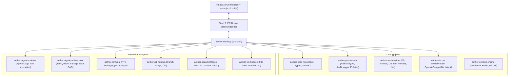

# AETHER IDE

> **Next-Generation Autonomous Multi-Agent AI IDE & Host Agent OS**
> 
> *Fusing the ergonomics of VS Code, the blazing speed of Zed, the structural intelligence of JetBrains, the conversational fluidity of Cursor & Claude Code, autonomous Multi-Agent DAG orchestration, and an AI Agent OS for safe host computer control.*

---

[](https://www.rust-lang.org/)
[](https://tauri.app/)
[](https://react.dev/)
[](https://www.typescriptlang.org/)
[](https://vitejs.dev/)
[](#security-architecture)

---

## Architecture Overview



---

## 3-in-1 Hybrid Workspace

AETHER IDE delivers three distinct operational modes seamlessly switched from the Title Bar:

1. **Normal IDE Mode**:
   - High-speed, focused developer editor powered by Monaco Editor (`@monaco-editor/react`).
   - Integrated system terminal dock powered by `xterm.js` and `portable-pty`.
   - Hierarchical file tree, full Git staging/commit panel, and instant workspace regex search.

2. **AI Agent IDE Mode**:
   - Interactive SVG visualization of the **5-Stage Autonomous Agent Swarm**:
     - 🏗️ **Architect**: System planning, dependency modeling, and interface definitions.
     - ⚡ **Coder**: Core implementation, syntax adherence, and functional synthesis.
     - 🧪 **Tester**: Unit tests, edge case assertions, and regression coverage.
     - 🔍 **Reviewer**: Code smell detection, lint validation, and architectural alignment.
     - 🛡️ **Security Auditor**: Zero-trust vulnerability scanning and privilege analysis.
   - Real-time telemetry dashboard (tokens consumed, active swarms, completed tasks, tool calls).
   - Real-time execution log streaming agent thoughts, tool arguments, and results.

3. **AI Agent OS Mode**:
   - Real-time host machine monitoring and safe autonomous system manipulation.
   - **Host Process Explorer**: Real-time PID listing, memory footprint inspection, search filter, and guarded process termination.
   - **Network & Socket Diagnostics**: High-precision TCP socket handshake testing (`tokio::net::TcpStream`) and sandboxed HTTP request probe (`reqwest`).
   - **Immutable Security Audit Ledger**: Cryptographically timestamped logs tracking every tool invocation, risk evaluation, and human authorization decision.

---

## Rust Crates Breakdown

The backend is engineered as a modular, high-cohesion, low-coupling multi-crate workspace:

| Crate | Purpose | Key Responsibilities |
|---|---|---|
| [`aether-core`](./crates/aether-core) | Domain Primitives & Bus | `EventBus`, `CancellationToken`, `AgentId`, `TaskId`, error hierarchy |
| [`aether-permission`](./crates/aether-permission) | Zero-Trust Security | `RiskAnalyzer` (regex & file heuristics), `PermissionManager`, `AuditLogger` |
| [`aether-tool-runtime`](./crates/aether-tool-runtime) | Sandboxed Tool Engine | `ToolRegistry`, `FsWriteFileTool`, `FsReadFileTool`, `TerminalExecuteTool`, `OsSystemInfoTool`, `OsProcessListTool`, `OsKillProcessTool`, `OsNetworkCheckTool`, `OsHttpRequestTool` |
| [`aether-workspace`](./crates/aether-workspace) | Virtual File System | `WorkspaceManager`, `FileTreeBuilder`, recursive tree explorer |
| [`aether-terminal`](./crates/aether-terminal) | Real Shell PTY | `PtyManager`, `PtySession`, `portable-pty` (PowerShell, Cmd, Git Bash) |
| [`aether-git`](./crates/aether-git) | Source Control | `GitManager`, repo initialization, staging, commit, diff extraction, branch tracking |
| [`aether-search`](./crates/aether-search) | Fast Search Engine | `SearchEngine`, regex & case-sensitive content search across workspace |
| [`aether-ai-core`](./crates/aether-ai-core) | Multi-Provider AI Core | `ModelRouter`, `OpenAiCompatibleProvider`, `MockModelProvider` (Claude, DeepSeek, GPT-4o, Ollama) |
| [`aether-context-engine`](./crates/aether-context-engine) | Context Assembler | `ContextBuilder`, active file tokens, git diff & system rules injection |
| [`aether-agent-runtime`](./crates/aether-agent-runtime) | Autonomous Execution Loop | `Agent`, `AgentRuntime`, multi-step autonomous tool execution with step limits |
| [`aether-agent-orchestrator`](./crates/aether-agent-orchestrator) | Multi-Agent Swarm DAG | `AgentOrchestrator`, `TaskQueue`, 5-Stage Team Pipeline DAG |
| [`src-tauri`](./src-tauri) | Desktop Host & IPC | Tauri 2 desktop app, state container, 25+ async IPC command handlers |

---

## Security Architecture

AETHER enforces strict guardrails before any system or filesystem modification:

1. **Risk Classification**:
   - `Safe`: Read-only queries, system metrics, workspace status.
   - `Low`: Read operations on local workspace files.
   - `Moderate`: Writing files within workspace boundary.
   - `High`: External process execution, git commits, network egress.
   - `Critical`: Destructive commands (`rm -rf`, `taskkill /F`, sensitive system paths).

2. **Permission Workflow**:
   - Dangerous operations are intercepted by `RiskAnalyzer`.
   - If policy requires approval (`Ask`), execution is paused and a native `PermissionDialog` is presented to the user.
   - Every approval, rejection, and execution is written to the immutable `AuditLogger`.

---

## Getting Started

### Prerequisites
- **Rust**: 1.78+ (`rustup default stable`)
- **Node.js**: 20+ (`npm` or `pnpm`)
- **Tauri 2 CLI**: `cargo install tauri-cli --version "^2.0"` (or via `npx @tauri-apps/cli`)
- **Build Tools**: Visual Studio 2022 C++ Build Tools (Windows) or `build-essential` (Linux)

### Development Setup

1. **Clone repository**:
   ```bash
   git clone https://github.com/syuumaimikan/AetherIDE.git
   cd AetherIDE
   ```

2. **Install frontend dependencies**:
   ```bash
   npm install
   ```

3. **Run Web Dev Server (Browser preview)**:
   ```bash
   npm run dev
   ```
   *Navigate to `http://localhost:5173/` in your browser to inspect the UI.*

4. **Launch Tauri Desktop Application**:
   ```bash
   cargo tauri dev
   # or
   npm run tauri:dev
   ```
   *Tauri automatically starts the Vite dev server and opens the native GPU-accelerated desktop window.*

### Running Test Suite

```bash
# Run all unit tests across all 11 crates
cargo test --workspace

# Run frontend typecheck and production bundle build
npm run build
```

---

## Documentation

Detailed technical documentation is available in the [`docs/`](./docs) folder:
- [User Guide & Workflows](./docs/USER_GUIDE.md)
- [System Architecture Deep Dive](./docs/ARCHITECTURE.md)
- [AI Agent OS & Host Process Control](./docs/AGENT_OS.md)
- [Security Governance & Zero-Trust Model](./docs/SECURITY_MODEL.md)
- [Multi-Agent Swarm Orchestration](./docs/MULTI_AGENT_SWARM.md)
- [Keyboard Shortcuts & Keybindings](./docs/KEYBINDINGS.md)
- [Tauri 2 Desktop IPC API Reference](./docs/API.md)

---

## License

Apache-2.0 © 2026 AETHER Autonomous Engineering Group
