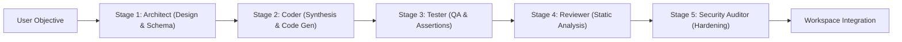

# AETHER Multi-Agent Swarm Orchestration

AETHER features a **5-Stage Autonomous Agent Swarm** engineered to execute complex software development lifecycle tasks with multi-agent consensus and role specialization.

---

## 1. 5-Stage Agent Pipeline

### Stage 1: Architect
- **Role**: High-level system architecture, component breakdown, module interfaces.
- **Model**: `Claude 3.7 Sonnet` (Extended Thinking).
- **Allowed Tools**: `fs_read_file`, `fs_list_dir`, `search_content`.
- **Output**: Markdown architectural blueprint specifying target files and API contracts.

### Stage 2: Coder
- **Role**: Implementation and code synthesis.
- **Model**: `DeepSeek R1 Code` / `Claude 3.7 Sonnet`.
- **Allowed Tools**: `fs_read_file`, `fs_write_file`, `terminal_execute`.
- **Output**: Source code edits and new module creation.

### Stage 3: Tester
- **Role**: Test suite generation and verification.
- **Model**: `Claude 3.7 Sonnet` / `GPT-4o`.
- **Allowed Tools**: `fs_read_file`, `fs_write_file`, `terminal_execute`.
- **Output**: Unit tests, integration assertions, and test run validation.

### Stage 4: Reviewer
- **Role**: Code quality inspection, anti-pattern detection, idiomatic styling.
- **Model**: `GPT-4o`.
- **Allowed Tools**: `fs_read_file`.
- **Output**: Code review findings and suggestions.

### Stage 5: Security Auditor
- **Role**: Zero-trust vulnerability audit, dependency inspection, privilege checking.
- **Model**: `Claude 3.7 Sonnet` / `DeepSeek R1`.
- **Allowed Tools**: `fs_read_file`.
- **Output**: Security compliance sign-off.

---

## 2. DAG Execution Engine

The orchestrator (`crates/aether-agent-orchestrator`) manages task scheduling:
- **Dependency Resolution**: Tasks specify `depends_on` lists and wait in `queued` state until all prerequisites transition to `completed`.
- **Failure Handling**: If an upstream stage encounters a fatal error, dependent tasks are paused and flagged for user intervention.
- **Dynamic Step Limits**: Each agent operates under a strict `max_steps` ceiling to prevent infinite tool-calling loops.
